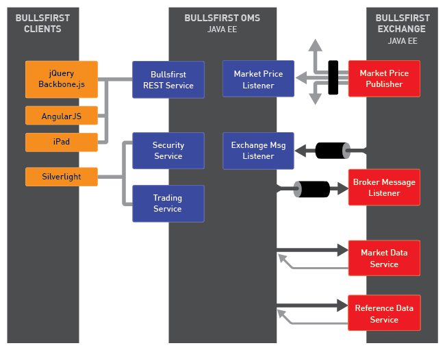

Bullsfirst is a sample trading system built to fulfill Archfirst’s goal of demonstrating how current and emerging technologies can be used to solve real world problems. It is a system of medium complexity whose domain is reasonably easy to understand.

## Resources

1. [Source Repository](https://github.com/archfirst/bullsfirst-server-java)
2. [Domain-Driven Design concepts](../domain-driven-design/)
