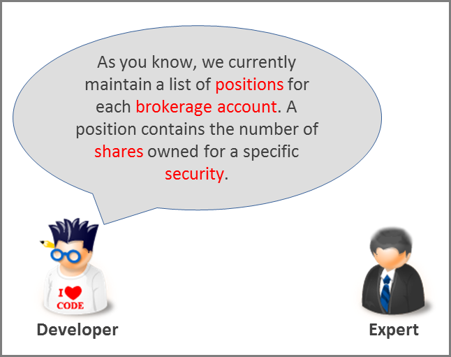
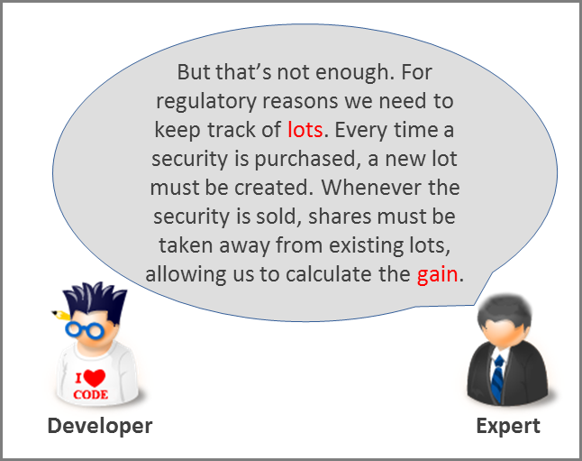
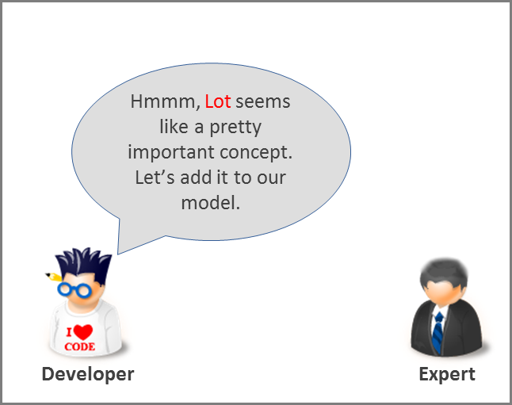

Developers will be developers – given a requirement, they will immediately start to think in terms code – classes, methods, algorithms, polymorphism and so on. Domain experts usually know nothing about all of this. They only know about securities, orders and how orders are matched to execute trades.

To overcome this difference in communication style, when we build a system, it is critical to establish a common language that is used by everyone on the project. When someone says something about the domain, others should understand precisely what they mean. In DDD talk, this common language is called the _Ubiquitous Language_.

How can we start building the ubiquitous language for a project? Here’s a hypothetical dialog between a software developer and a domain expert in our trading example. Note the highlighted terms that have special meanings in the domain.

As a result of this conversation, the domain model was updated as shown below.

The model uses the Ubiquitous Language to provide a rich visual view of the domain. It provides the precision needed to implement the domain correctly. If a domain model cannot be understood by the domain experts, then there is something wrong with it. The next section explains in more detail what a domain model is and how to construct it.
