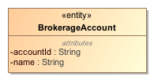
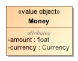
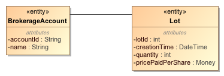
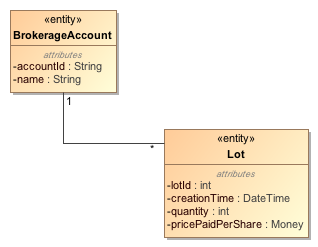

The domain model uses the Ubiquitous Language to provide a rich visual view of the domain. It primarily consists of entities, value objects and relationships. Let's take a closer look.

## Entity

We define a domain concept as an _Entity_ when we care about it's individuality, when it is important to distinguish it from all other objects in the system. An entity will always have a unique identifier. For example, in Bullsfirst, a _BrokerageAccount_ is an entity with _accountId_ as its unique identifier. An account with an id of '00718-5362' is distinct from any other account or object in the system.

Aside from a unique identifier, an entity may have other attributes that define its characteristics, but those attributes do not have to be unique. For example, two brokerage accounts can have the same name, "My Brokerage Account", and that's just fine.

## Value Object

An object that represents some descriptive aspect of the domain, but has no conceptual identity is called a _Value Object_. A good example of a value object is _Money_. While Money is defined in terms of an amount and a currency, it has no identity of its own - $100 is $100, it has no identity (at least in our domain).

## Entities vs. Value Objects

How can you tell if a domain concept is an entity or a value object? In addition to having a unique identity, an entity encapsulates state that can change continuously over time. Changes may be so extensive that the object might seem very different from what it once was. Yet, it is the same object with the same identity. On the other hand, a value object is just a value - it quantifies or describes a property of another object, usually an entity. If the property changes, the value object can be completely replaced by another with the new value. For example, if the current balance of a BrokerageAccount changes from $1000 to $2000, you can throw away the Money object that represented $1000 and replace it with a new one representing $2000.

Developers may have a tendency to model value objects as entities because they may need to store value objects as distinct rows in a database table. While this approach is required to implement a collection of value objects in the relational model, don't let it influence your domain model. If you do, your domain model will not reflect true DDD thinking.

For a detailed discussion of these concepts, read [Implementing Domain-Driven Design](http://amzn.com/0321834577) by Vaughn Vernon.

## Relationships

Entities and value objects can be related to one another. It is valuable to show such relationships in our domain model. While it is easy to get bogged down with different kinds of relationships, I suggest that you start with the simple _Association_ relationship - all it says is that two objects are related in some way. An association is shown by drawing a line between the related objects. For example, the diagram below shows that the _BrokerageAccount_ entity is related to the _Lot_ entity.

The only other important aspect of a relationship is the _multiplicity_ of each end. We want to somehow say that a brokerage account can have multiple lots. This is done by putting a '1' on the BrokerageAccount end and a '\*' (representing 'zero-to-many') on the Lot end. Now the diagram reads as: "1 BrokerageAccount has zero-to-many Lots".

Note that I have also changed the layout to indicate that the BrokerageAccount is the "parent" in this relationship and the Lot is a "child". A good layout can aid in the understanding of the domain, I recommend that you pay extra attention to it. A bad layout can cause unnecessary confusion. For example, putting the Lot above the BrokerageAccount would reduce the understandability of the diagram. When the two entities are peers, you may want to show them side by side.

The diagram above shows a one-to-many relationship. Other common relationships are one-to-one and many-to-many. For example, _Country_ to _Capital_ is a one-to-one relationship, whereas _Student_ to _Course_ is a many-to-many relationship. Also note that you can have relationships between entities and value objects and also between value objects and value objects. For example, in the diagram above, we could have pulled out the 'pricePaidPerShare' attribute from the Lot and shown it as a relationship between the Lot and the Money value object. These are equivalent representations, the latter gives more emphasis to the relationship.

## Tips and Tricks

Here are some additional tips on creating good domain models:

-   Avoid introducing software concepts when creating a domain model. It is _not_ an exercise in software design or database design! The focus should be on understanding the business domain and the functional requirements of the system under development. As a consequence, the domain model should be created and owned _jointly_ by domain experts, software developers, UX designers and other members of the team.
-   A good domain model should translate directly into the core domain layer of the system without introducing technical concerns like persistence, input and output mechanisms. We will talk more about this in later sections.
-   The process of creating a domain model is very compatible with Agile practices. You don't have to create the entire domain model before moving into implementation. It's probably good to start with a general idea of the various subject areas in your domain and then deep dive into specific ones as needed for the feature under implementation.
-   Do not cram your entire domain into one diagram. A diagram with hundreds of objects and relationships is not understandable by normal human beings! Break it up into smaller subject areas. Remember the rule of [Seven, Plus or Minus Two](http://www.musanim.com/miller1956/) - limit the number of objects on your diagrams from 5 to 9!
-   Avoid crossing of relationships. If you can't draw your diagram without crossing relationships, it is probably too complex. Break it into smaller pieces.
