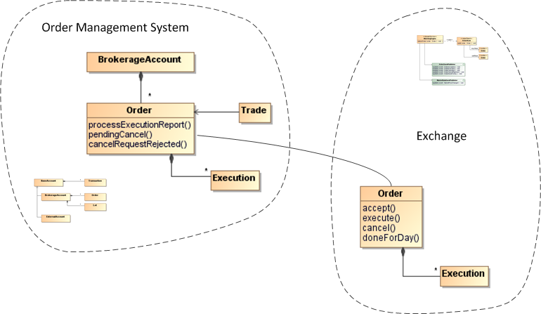

The sheer volume of concepts on a large project can be daunting. For example, a typical brokerage firm will have a large number of interrelated functions such as customer acquisition, account management, order management, order execution and so on. Each of these functions will have some distinct and some overlapping concepts. One could theoretically conceive of a domain model for the entire enterprise, however such a large domain model is neither feasible nor cost effective. We must divide large domains into smaller manageable models, each of which is _bounded within a context_.

There is no magic formula to divide a large domain into smaller ones. The general rule of thumb is to group together elements that are related and form a natural function. The model should be small enough that it can be managed by one team without being distracted or confused by outside issues.

In this vein, we have broken Bullsfirst into two bounded contexts, each with its own model:

1. **Bullsfirst Order Management System:** Responsible for order creation, maintenance and reporting
2. **Bullsfirst Exchange:** Responsible for order matching and execution

While the two contexts have overlapping concepts (such as orders and executions), their focus is different enough that we should not tangle them together. A _Context Map_, such as the following, provides a higher level view to understand how the two models fit into the overall picture. As you can see, the Exchange treats an Order as a standalone entity – it is only concerned about matching orders and executing them. On the other hand, the OMS focuses on order management – it associates an order with BrokerageAccounts and Trades as the order progresses through its lifecycle.

