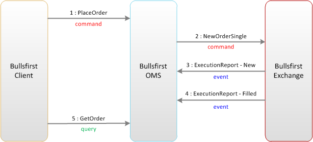

It’s now time to talk about an important pattern called _Command-Query Separation (CQS)_. We will tie this to Bounded Contexts in a minute, but let’s first understand what it is. Command-Query Separation is an approach to simplify designs and improve performance by separating reads from writes. The approach recommends that every method should either be a Command that performs an action, or a Query that returns data to the caller, but not both. In other words, asking a question should not change the answer. Here’s an example from Bullsfirst that illustrates the Command-Query Separation pattern:

```java
public interface TradingService {
    // ----- Commands -----
    void placeOrder(Long accountId, OrderParams params);
    void cancelOrder(Long orderId);

    // ----- Queries -----
    List<Order> getOrders(OrderCriteria criteria);
    OrderEstimate getOrderEstimate(Long accountId, OrderParams params);
}
```

As you will see later, the clear separation between commands and queries will influence the design of our domain objects, giving them rich behaviors instead of treating them like dumb pieces of data (the [Anemic Objects](http://martinfowler.com/bliki/AnemicDomainModel.html) anti-pattern).

With respect to Bounded Contexts:

-   Commands _tell_ a bounded context to do something
-   Queries _ask_ for information from it

Another term that you hear in CQS talk is an _Event_ – a Bounded Context generates events to inform that something happened inside it. The diagram below shows how commands, queries and events are used in Bullsfirst to communicate between Bounded Contexts.



_Command-Query Responsibility Segregation (CQRS)_ is another popular pattern that takes CQS a step further by creating two separate end-points for reads and writes.
