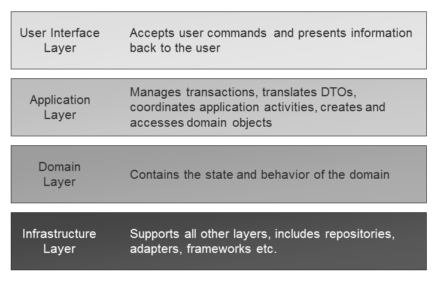
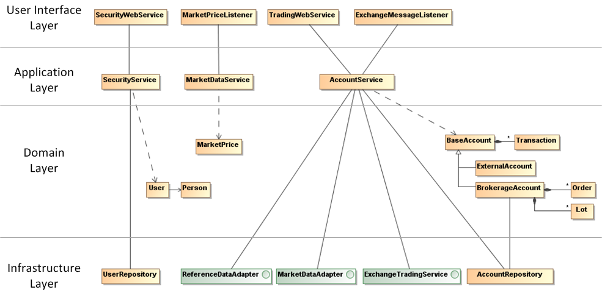

Now let’s zoom into the Bullsfirst OMS and discuss DDD as it relates to a single bounded context. The first concept we’ll talk about is called _Layered Architecture_.

In general, to create a full-fledged software application we will have to implement a lot more than just the domain model – user interface, database access and external service adapters are just a few examples. If we start implementing these elements without much thought to their organization, we will soon have a ball of mud, with business logic intermingled with UI and data access code. This is bad because even a minor enhancement will require careful tracing of the entire application.

Creating applications that can handle very complex tasks requires separation of concerns. This is where the concept of a _Layered Architecture_ comes in. The basic idea is to structure an application into four conceptual layers:



How does Bullsfirst OMS implement these layers? Here’s a high level overview



## User Interface Layer

The OMS does not have a user interface. However, it exposes four services that allow other applications to interact with it:

1. **SecurityWebService** provides user registration and authentication for front-end clients
2. **TradingWebService** provides trading related functions such as order and account management
3. **MarketPriceListener** listens to the exchange for market price change messages
4. **ExchangeMessageListener** listens to the exchange for order status change messages

In the context of layered architecture, these four services provide the “user interface” for external applications – they translate incoming requests to method calls for the application layer and in the case of web services, translate the return values to SOAP responses. In addition, this layer is also responsible for transaction management by starting transactions for every service call.

## Application Layer

The application layer is responsible for creation and retrieval of domain objects, as well as calling their methods to satisfy user commands. The Bullsfirst OMS application layer consists of three services: SecurityService, MarketDataService and AccountService. Each service receives commands and queries from the layer above and in turn interacts with the domain layer to perform requested actions. Let’s look at the following AccountService method as an example:

```java
public void cancelOrder(String username, Long orderId) {

    // Check authorization on account
    Order order = brokerageAccountRepository.findOrder(orderId);
    checkAccountAuthorization(
            getUser(username),
            order.getAccount().getId(),
            BrokerageAccountPermission.Trade);

    // Cancel order
    order.pendingCancel(orderEventPublisher);
    exchangeTradingService.cancelOrder(order);
}
```

Note that the parameters to the method (username and orderId) are value objects. That’s because the layer above (the User Interface layer) does not have domain objects – all it has are some values sent by the client. Looking inside the method you will find that the value objects are used to fetch the real `Order` and call its `pendingCancel` method. You will also notice that the method has access to the `brokerageAccountRepository` which is part of the infrastructure layer. As we’ve now seen, the Application layer coordinates application activity by retrieving domain objects and calling their methods.

## Domain Layer

We will look at this layer in more detail in the next section.

## Infrastructure Layer

This layer consists of:

* User and Account repositories for managing users and accounts in the database
* Adapters for accessing reference data and market data from the exchange
* TradingService proxy for sending trading commands to the exchange
