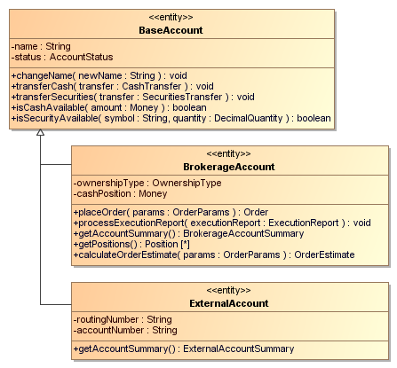
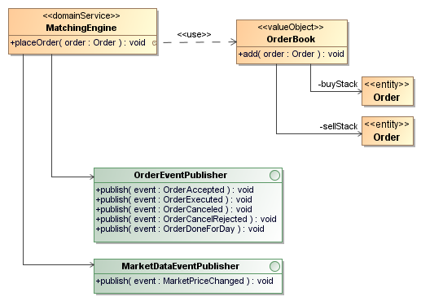
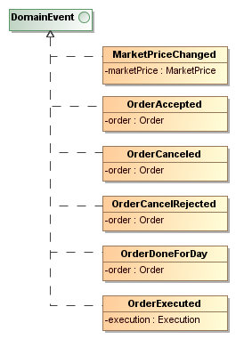
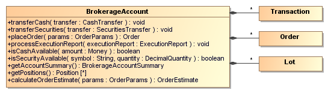

This layer is the heart of the application. It consists of entities, value objects, domain services and domain events.

### Entities

We talked about entities earlier in the [Domain Model](../domain-driven-design-3-domain-model) section. When it is important to distinguish an object from all other objects in the system, it should be designed as an entity. An entity will always have a unique identifier. Bullsfirst contains several entities such as User, Account, Transaction, Order and Lot. Accounts are particularly interesting because there are two types of accounts: BrokerageAccounts and ExternalAccounts. The diagram below shows how these entities are implemented, pulling common state and behavior into BaseAccount.



Note that the Command-Query Separation pattern has been applied to these entities. I use the template shown below as a starting point to code my entities – it helps me think in terms of commands, queries and the supporting code that I need to make my entities work.

```java
public class BrokerageAccount {
    // ----- Constructors -----

    // ----- Commands -----

    // ----- Queries -----

    // ----- Attributes -----

    // ----- Getters and Setters -----
}
```

Constructors, Commands and Queries are the most important elements of an entity. So I define them at the top. Attributes, getters and setters are really implementation details and hence they are placed at the bottom. Ideally I would like to have no setters in my entities (all changes should be made through commands), but practically, I was not able to do it due to possible limitations in Java Persistence API (JPA) (field-based access was triggering compilation errors). As a compromise, I have made all the setters private.

### Value Objects

We talked about value objects earlier in the [Domain Model](../domain-driven-design-3-domain-model) section. An object that represents some descriptive aspect of the domain, but has no conceptual identity is called a _Value Object_. A good example of a value object is _Money_.


### Domain Services

Some aspects of the domain are not easily mapped to objects. The best practice is to declare these as _Domain Services_. Domain Services are distinct from Application Services – unlike Application Services, they do contain business logic. The best example of a Domain Service in Bullsfirst is the MatchingEngine (in the Exchange) – it contains business logic to match orders and execute trades. This logic does not naturally belong inside the Order because we need to apply this logic across many orders.



A good Domain Service has three characteristics:

1. The operation relates to a domain concept that is not a natural part of an Entity or a Value Object.
2. The interface is defined in terms of other objects in the domain model
3. The operation is stateless.

### Domain Events

A _Domain Event_ is a simple object that represents an interesting occurrence in the domain. Domain Events help decouple various components of an application. The diagram below shows the Domain Events used in Bullsfirst Exchange.



As an example, the MatchingEngine publishes a MarketPriceChanged event when the price of a security changes as a result of matching orders. This event is caught by MarketPricePublisher, which publishes the price change to external systems. This approach decouples the MatchingEngine from external interfaces.

### Aggregates

In any realistic domain, entities are related to one another. In the case of very complex domains, it is easy to end up with an unmanageable tangled web of relationships. Moreover, these complex relationships trigger high degree of database contention, resulting in poor performance or even deadlocks. What we really need is some guidance on organizing complex relationships. Aggregates provide this guidance.

An _Aggregate_ is a group of associated objects acting as a unit for the purpose of data changes. One object within the aggregate is designated as the root – it is usually the “owner” of all the other objects. The root is the only member of the Aggregate that outside objects are allowed to hold references to. Thus outside objects can call methods of the root, giving it commands and querying for information. When the root needs to send information back, it returns Value Objects. I personally prefer a little more flexibility and don’t mind returning internal objects as long as long as they are used for querying.

A good example of an Aggregate within Bullsfirst is the collection of BrokerageAccount, Transaction, Order and Lot.



In this example, BrokerageAccount is the aggregate root - it “owns” Transactions, Orders and Lots. Objects outside the aggregate only have access to its root. They can affect the internals only via commands sent to the root.
