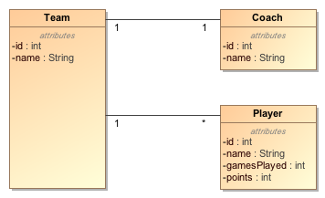
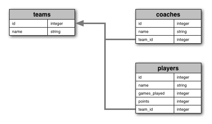

[JoinJS](https://github.com/archfirst/joinjs) is a JavaScript library to map complex database joins to nested objects. It's a simpler alternative to a full-blown Object-Relation Mapper (ORM), and gives you direct control over your database interactions. In this article, we will explore the power of JoinJS using a simple hands-on example.

## Motivation: Direct, no-nonsense control over your database

Traditional ORMs introduce a thick layer of abstraction between objects and database tables. This usually hinders, rather than helps, developer productivity. In complex use cases, it is difficult enough to devise efficient queries, but with ORMs you also have to teach them to generate the same query. It takes extra time to do this and you may not be able to produce the same query. In the worst case scenario, the ORM may hit the database multiple times for something that you were able to do in a single query.

JoinJS takes a much simpler and straightforward approach inspired by a popular Java mapping framework called [MyBatis](http://mybatis.github.io/mybatis-3/) (see my post on [MyBatis vs. other ORMs](../mybatis-vs-other-orms/)). You can use any database driver or query builder (such as [Knex.js](http://knexjs.org/)) to query your database, however you use JoinJS to convert the returned results into a hierarchy of nested objects.

## Example - Basketball Team Stats

Let's create an application to maintain stats for basketball teams. Shown below is a simple domain model for the purpose of this example. There is a one-to-one relationship between teams and coaches (a team has one coach), and a one-to-many relationship between teams and players (a team has many players).



Follow the steps below to implement the _Team Stats_ application. Note that the completed code is available in the [JoinsJS Tutorial](https://github.com/archfirst/joinjs-tutorial) repository on Github.

### Step 1: Create a database

Here's the database schema for this domain:



Let's create these tables in a database. I will use PostgreSQL for this example, but you can use your favorite database as long as you know how to query it through JavaScript using a database driver or a query builder such as Knex.js. First create a database called _teams_. Then create the three tables using the following SQL statements. If you prefer to create your schema using JavaScript, you can use [this code](https://github.com/archfirst/joinjs-tutorial/blob/master/sql/create-schema.js) that uses Knex to do the same.

```sql
-- Create tables
CREATE TABLE teams (
  id SERIAL PRIMARY KEY,
  name VARCHAR(64) NOT NULL
);

CREATE TABLE coaches (
  id SERIAL PRIMARY KEY,
  name VARCHAR(64) NOT NULL,
  team_id INTEGER NOT NULL
);

CREATE TABLE players (
  id SERIAL PRIMARY KEY,
  name VARCHAR(64) NOT NULL,
  games_played INTEGER NOT NULL,
  points INTEGER NOT NULL,
  team_id INTEGER NOT NULL
);

-- Add foreign keys
ALTER TABLE coaches
  ADD CONSTRAINT coaches_team_id_foreign FOREIGN KEY (team_id)
  REFERENCES teams (id);

ALTER TABLE players
  ADD CONSTRAINT players_team_id_foreign FOREIGN KEY (team_id)
  REFERENCES teams (id);
```

Now let's load some data into these tables - two teams with one coach and two players in each team:

```sql
-- teams
INSERT INTO teams (id, name) VALUES (1, 'Boston Celtics');
INSERT INTO teams (id, name) VALUES (2, 'Los Angeles Lakers');

SELECT setval('teams_id_seq', (SELECT MAX(id) FROM teams));

-- coaches (2007-2008)
INSERT INTO coaches (id, name, team_id) VALUES (1, 'Doc Rivers',   1);
INSERT INTO coaches (id, name, team_id) VALUES (2, 'Phil Jackson', 2);

SELECT setval('coaches_id_seq', (SELECT MAX(id) FROM coaches));

-- players (2007-2008)
INSERT INTO players (id, name, games_played, points, team_id)
VALUES (1, 'Paul Pierce',   80, 1570, 1);

INSERT INTO players (id, name, games_played, points, team_id)
VALUES (2, 'Kevin Garnett', 71, 1337, 1);

INSERT INTO players (id, name, games_played, points, team_id)
VALUES (3, 'Kobe Bryant',   82, 2323, 2);

INSERT INTO players (id, name, games_played, points, team_id)
VALUES (4, 'Pau Gasol',     66, 1246, 2);

SELECT setval('players_id_seq', (SELECT MAX(id) FROM players));
```

### Step 2: Create a Node.js project

If you don't have Node.js installed on your machine, install it first.

-   on OSX, install [home brew](http://brew.sh/) and then type _brew install node_
-   on Windows, use the installer available at [nodejs.org](http://nodejs.org/)

Create a folder called _joinjs-tutorial_ to store your source. In this folder, create a file called _package.json_ with the following content. This file specifies JoinJS and other required libraries as dependencies for your project.

```json
{
    "name": "joinjs-tutorial",
    "description": "JoinJS Tutorial",
    "version": "0.1.0",
    "dependencies": {
        "join-js": "^0.4.0",
        "knex": "^0.8.6",
        "pg": "^4.4.0"
    }
}
```

Open a shell in the _joinjs-tutorial_ folder and issue the command _npm install_. This will download all the required libraries to the _node_modules_ folder under your project directory.

Create a file called _team-stats.js_ in the _joinjs-tutorial_ folder. We will build a query in this file, step-by-step, to return a join of multiple tables. We will then use JoinJS to convert the result into a set of nested objects representing teams, their coaches and player stats. I will be using Knex to build my queries, but you can use any database driver that works with your database. As a starter, add the following code to the _team-stats.js_ file. The first block of this code initializes Knex for querying the teams database. The second block defines a function with a very simple _select \* from teams_ query. The third block essentially calls this function and prints the results.

```javascript
// --------------------------------------------------------
// Initialize knex (the query builder)
// --------------------------------------------------------
var knex = require('knex')({
    client: 'postgresql',
    debug: true,
    connection: {
        host: 'localhost',
        user: '',
        password: '',
        database: 'teams',
        charset: 'utf8'
    }
});

// --------------------------------------------------------
// Get team stats
// --------------------------------------------------------
function getTeamStats() {
    return knex.select().from('teams');
}

// --------------------------------------------------------
// Main
// --------------------------------------------------------
getTeamStats().then(function(teams) {
    console.log(JSON.stringify(teams, null, 4));

    // close the connection
    return knex.destroy();
});
```

Now run the application using the command _node team-stats.js_ as shown below. Since Knex has been configured in debug mode, you will first see the SQL statement generated by Knex and then the result of the query. The result is a JavaScript array with two objects representing the two teams in our database. This is very straightforward - you don't need any kind of mapping since we have not hit the complexity of table joins.

```javascript
$ node team-stats.js
{ method: 'select',
  options: {},
  bindings: [],
  sql: 'select * from "teams"' }
[
    {
        "id": 1,
        "name": "Boston Celtics"
    },
    {
        "id": 2,
        "name": "Los Angeles Lakers"
    }
]
```

### Step 3: Define one-to-one relationships

Let's enhance the query to include the coach for each team. Here's the raw query and result of running it in the SQL shell. Note that the result is a flat set of records containing elements from both team and coach tables.

```sql
SELECT   t.id            AS team_id,
         t.name          AS team_name,
         c.id            AS coach_id,
         c.name          AS coach_name
FROM     teams t
         LEFT OUTER JOIN coaches c
                      ON c.team_id = t.id;


 team_id |     team_name      | coach_id |  coach_name
---------+--------------------+----------+--------------
       1 | Boston Celtics     |        1 | Doc Rivers
       2 | Los Angeles Lakers |        2 | Phil Jackson
```

Now let's modify the _getTeamStats( )_ function with this query. We will also introduce JoinJS to help us convert the flat result set into a hierarchy of JavaScript objects. This is done by "teaching" JoinJS how to map the columns in the result set to JavaScript objects and their properties. The code below passes an array of 2 result maps into JoinJS - first describes the _Team_ object and the second describes the _Coach_ object.

```javascript
// --------------------------------------------------------
// Get team stats
// --------------------------------------------------------
var joinjs = require('join-js').default;

var resultMaps = [
    {
        mapId: 'teamMap',
        idProperty: 'id',
        properties: ['name'],
        associations: [
            { name: 'coach', mapId: 'coachMap', columnPrefix: 'coach_' }
        ]
    },
    {
        mapId: 'coachMap',
        idProperty: 'id',
        properties: ['name']
    }
];

function getTeamStats() {
    return knex
        .select(
            't.id as team_id',
            't.name as team_name',
            'c.id as coach_id',
            'c.name as coach_name'
        )
        .from('teams as t')
        .leftOuterJoin('coaches as c', 'c.team_id', 't.id')
        .then(function(resultSet) {
            return joinjs.map(resultSet, resultMaps, 'teamMap', 'team_');
        });
}
```

So let's try to understand result maps. Remember that result maps teach JoinJS how to map columns in a result set to JavaScript objects and their properties. Here's the first of the two result maps in the code above:

```javascript
{
    mapId: 'teamMap',
    idProperty: 'id',
    properties: ['name'],
    associations: [
        {name: 'coach', mapId: 'coachMap', columnPrefix: 'coach_'}
    ]
}
```

-   `mapId`: Every result map has a unique id. In the example above, the result map describes the _Team_ object and hence it has been given an id of `teamMap`. You can call it anything else as long as it is distinct from other mapIds.
-   `idProperty`: Every object that needs to be mapped should have a property that identifies it. The idProperty specifies the name of this property. In the example above, idProperty specifies that the name of the identifying property is `id`. This form of idProperty also assumes that the corresponding database column has the same name. If that's not the case, then idProperty should be specified as an object literal, e.g. `{name: 'id', column: 'person_id'}`. Here _name_ is the name of the identifying property in JavaScript and _column_ is the name of the identifying column in the result set. Incidentally `id` is the default value of the _idProperty_, so you can leave it out completely in the above example. You may also be wondering why the identifying column is assumed to be _id_ instead of _team_id_ - that's how it appears in the result set. That's where the concept of _columnPrefix_ comes in. To provide maximum flexibility, we specify the column names generically in idProperty (as we have above) and then specify column prefixes for a whole set of columns.
-   `properties`: This is an array that defines mappings for the other properties of the object (besides the id property). In the example above it's again a straightforward mapping of column _name_ to object property _name_. A more interesting use case would be to convert snake_case column names to camelCase object properties, e.g. `{name: 'gamesPlayed', column: 'games_played'}` (we will use this one later).
-   `associations`: This is an array that defines one-to-one relationships (a.k.a. associations) with other objects. In the example above we are defining one association from Team to Coach. The association specification has three properties:
    -   _name_: defines the name of the object property that represents the associated object. In our example, a property called _coach_ will be injected in the Team object to represent the associated object.
    -   _mapId_: mapId of the associated object, in this case the id of the Coach map.
    -   _columnPrefix_: The prefix to apply to every column name of the associated object. The default value is an empty string. However, in our case we know that all columns of the Coach object are prefixed with `coach_`. So we specify this column prefix.

Now that we understand how the result maps work, let's focus our attention to the JoinJS `map()` call.

```javascript
return joinjs.map(resultSet, resultMaps, 'teamMap', 'team_');
```

We pass the resultSet and the resultMaps as the first two parameters. Then we specify that `teamMap` is the map for the top-level objects that should be returned. Finally we specify the column prefix to be used for the top-level objects, in this case `team_`.

Now run the application. You should see an array of team objects with nested coach objects - yay!

```javascript
[
    {
        id: 1,
        name: 'Boston Celtics',
        coach: {
            id: 1,
            name: 'Doc Rivers'
        }
    },
    {
        id: 2,
        name: 'Los Angeles Lakers',
        coach: {
            id: 2,
            name: 'Phil Jackson'
        }
    }
];
```

### Step 4: Define one-to-many relationships

Let's enhance the query to include the players for each team. Here's the raw query and result of running it in the SQL shell. Note that the result set is now even wider, with many more columns.

```sql
SELECT   t.id            AS team_id,
         t.name          AS team_name,
         c.id            AS coach_id,
         c.name          AS coach_name,
         p.id            AS player_id,
         p.name          AS player_name,
         p.games_played  AS player_games_played,
         p.points        AS player_points
FROM     teams t
         LEFT OUTER JOIN coaches c
                      ON c.team_id = t.id
         LEFT OUTER JOIN players p
                      ON p.team_id = t.id;


 team_id |     team_name      | coach_id |  coach_name  | player_id |  player_name  |...
---------+--------------------+----------+--------------+-----------+---------------+---
       1 | Boston Celtics     |        1 | Doc Rivers   |         2 | Kevin Garnett |...
       1 | Boston Celtics     |        1 | Doc Rivers   |         1 | Paul Pierce   |...
       2 | Los Angeles Lakers |        2 | Phil Jackson |         4 | Pau Gasol     |...
       2 | Los Angeles Lakers |        2 | Phil Jackson |         3 | Kobe Bryant   |...
```

Now let's modify the _getTeamStats( )_ function with this query. We will also add a result map for players. The idea is the same as before except that the relationship between _Team_ and _Player_ is one-to-many. These relationships are specified using the _collections_ array in the result map (as opposed to _associations_).

```javascript
// --------------------------------------------------------
// Get team stats
// --------------------------------------------------------
var joinjs = require('join-js').default;

var resultMaps = [
    {
        mapId: 'teamMap',
        idProperty: 'id',
        properties: ['name'],
        associations: [
            { name: 'coach', mapId: 'coachMap', columnPrefix: 'coach_' }
        ],
        collections: [
            { name: 'players', mapId: 'playerMap', columnPrefix: 'player_' }
        ]
    },
    {
        mapId: 'coachMap',
        idProperty: 'id',
        properties: ['name']
    },
    {
        mapId: 'playerMap',
        idProperty: 'id',
        properties: [
            'name',
            { name: 'gamesPlayed', column: 'games_played' },
            'points'
        ]
    }
];

function getTeamStats() {
    return knex
        .select(
            't.id as team_id',
            't.name as team_name',
            'c.id as coach_id',
            'c.name as coach_name',
            'p.id as player_id',
            'p.name as player_name',
            'p.games_played as player_games_played',
            'p.points as player_points'
        )
        .from('teams as t')
        .leftOuterJoin('coaches as c', 'c.team_id', 't.id')
        .leftOuterJoin('players as p', 'p.team_id', 't.id')
        .then(function(resultSet) {
            return joinjs.map(resultSet, resultMaps, 'teamMap', 'team_');
        });
}
```

Now run the application. You should see an array of teams with nested coach and player objects.

```javascript
[
    {
        id: 1,
        name: 'Boston Celtics',
        coach: {
            id: 1,
            name: 'Doc Rivers'
        },
        players: [
            {
                id: 2,
                name: 'Kevin Garnett',
                gamesPlayed: 71,
                points: 1337
            },
            {
                id: 1,
                name: 'Paul Pierce',
                gamesPlayed: 80,
                points: 1570
            }
        ]
    },
    {
        id: 2,
        name: 'Los Angeles Lakers',
        coach: {
            id: 2,
            name: 'Phil Jackson'
        },
        players: [
            {
                id: 4,
                name: 'Pau Gasol',
                gamesPlayed: 66,
                points: 1246
            },
            {
                id: 3,
                name: 'Kobe Bryant',
                gamesPlayed: 82,
                points: 2323
            }
        ]
    }
];
```

### Step 5: Define custom objects

So far JoinJS has been creating Plain Old JavaScript Objects (POJOs) for us. However it can also create custom objects. Suppose we have a custom `Team` object that knows how to calculate the total points scored by a team. Add the following code to your _team-stats.js_ file before declaring the result maps.

```javascript
// --------------------------------------------------------
// Team
// --------------------------------------------------------
function Team() {}

Team.prototype.calculateTotalPoints = function() {
    var i;
    var numPlayers = this.players.length;

    var totalPoints = 0;
    for (i = 0; i < numPlayers; i++) {
        totalPoints = totalPoints + this.players[i].points;
    }

    return totalPoints;
};
```

Now add the `createNew` property to the team result map as shown below. This teaches JoinJS how to create custom team objects.

```javascript
{
    mapId: 'teamMap',
    createNew: function() {
        return new Team();
    },
    idProperty: 'id',
    properties: ['name'],
    associations: [
        {name: 'coach', mapId: 'coachMap', columnPrefix: 'coach_'}
    ],
    collections: [
        {name: 'players', mapId: 'playerMap', columnPrefix: 'player_'}
    ]
}
```

Finally, modify the `Main` block as follows, adding the code to calculate total points for each team.

```javascript
// --------------------------------------------------------
// Main
// --------------------------------------------------------
getTeamStats().then(function(teams) {
    console.log(JSON.stringify(teams, null, 4));

    console.log('');

    var i = 0;
    var numTeams = teams.length;
    for (i = 0; i < numTeams; i++) {
        console.log(teams[i].name);
        console.log('    Total points: ' + teams[i].calculateTotalPoints());
    }

    // close the connection
    return knex.destroy();
});
```

Now run the application. You should see the total points for each team at the end of the output:

```javascript
Boston Celtics
    Total points: 2907
Los Angeles Lakers
    Total points: 3569
```

This is possible because JoinJS now creates custom `Team` objects for you.

## Conclusion

We have shown that JoinJS gives you direct no-nonsense control over your relational database. It allows you to execute hand-crafted queries for optimal performance and simplifies the job of converting the results to arbitrarily nested objects. Once you have mastered the basics, check out the [Manage My Money](https://github.com/archfirst/manage-my-money-server) project to see how you can build a full-fledged application complete with a front-end using JoinJS and other useful libraries.

_If you find JoinJS useful, please [star it on Github](https://github.com/archfirst/joinjs)._
